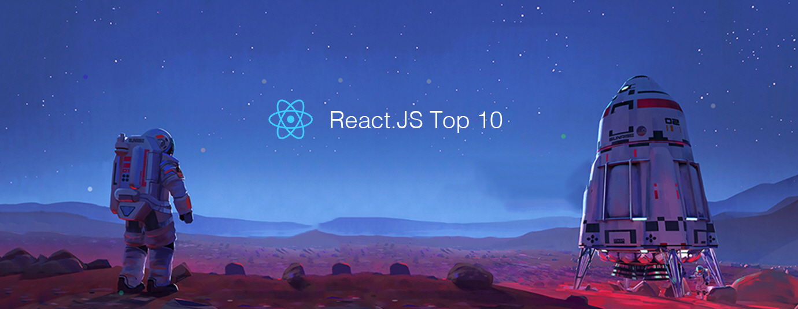

# React.js Top 10 Articles for the Past Month (v.May 2018)

</a>

For the past month, we ranked nearly 1,100 React.js articles to pick the Top 10 stories that can help advance your career (0.9% chance).
 
* Topics in this list: Patterns, Tutorial, GraphQL, Medium.com clone, Context, Learning React, Recat Native, Instagram clone, React 16.3
* Also published on the [publication](https://goo.gl/tRTQEA)

 

#### Course of the month:

[A) Beginners: The Complete React Web Developer Course (with Redux)](http://bit.ly/2mM28xA) [5,106 recommends, 4.8/5 stars]

[B) React Native: The Complete React Native and Redux Course.](http://bit.ly/2lLyx6f) [16,415 recommends, 4.6/5 stars]

 

## Rank 1
### [React in patterns: A free ebook about common design patterns used in developing with React.js](https://krasimir.gitbooks.io/react-in-patterns/content/
?utm_source=mybridge&utm_medium=blog&utm_campaign=read_more)

 

## Rank 2
### [Learn React.js in 5 minutes](https://medium.freecodecamp.org/learn-react-js-in-5-minutes-526472d292f4?utm_source=mybridge&utm_medium=blog&utm_campaign=read_more)

 

## Rank 3
### [A complete React with GraphQL Tutorial - RWieruch](https://www.robinwieruch.de/react-with-graphql-tutorial?utm_source=mybridge&utm_medium=blog&utm_campaign=read_more)

 

## Rank 4
### [Build simple Medium.com on Node.js and React.js](https://codeburst.io/build-simple-medium-com-on-node-js-and-react-js-a278c5192f47?utm_source=mybridge&utm_medium=blog&utm_campaign=read_more)

 

## Rank 5
### [How to Use React Context to Build a Multilingual Website Pt.1](https://blog.alexdevero.com/react-context-multilingual-website-pt1?utm_source=mybridge&utm_medium=blog&utm_campaign=read_more)

 

## Rank 6
### [Gooact: React in 160 lines of JavaScript](https://medium.com/@sweetpalma/gooact-react-in-160-lines-of-javascript-44e0742ad60f?utm_source=mybridge&utm_medium=blog&utm_campaign=read_more)

 

## Rank 7
### [How to React ⚛️ Let’s see how learning React ⚛️ in the right order can make it less overwhelming](https://blog.kentcdodds.com/how-to-react-%EF%B8%8F-9e87f48414d2?utm_source=mybridge&utm_medium=blog&utm_campaign=read_more)

 

## Rank 8
### [React Native YouTube Replica](https://medium.com/react-native-training/react-native-youtube-replica-f378200d91f0?utm_source=mybridge&utm_medium=blog&utm_campaign=read_more)

 

## Rank 9
### [Build an Instagram clone with React — Part 1: Create the UI](https://pusher.com/tutorials/instagram-clone-part-1?utm_source=mybridge&utm_medium=blog&utm_campaign=read_more)

 

## Rank 10
### [React 16.3 - New Context API, Updated Lifecycle Hooks, New Ref API](https://www.youtube.com/watch?v=yaZzJ37Qb0U?utm_source=mybridge&utm_medium=blog&utm_campaign=read_more)
