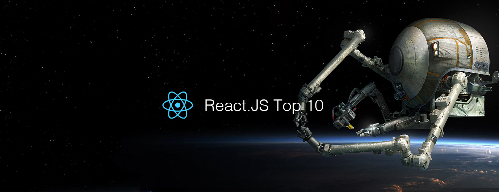

# React.js Top 10 Articles for the Past Month (v.May 2019)

</a>

For the past month, we ranked nearly 1,500 React.js articles to pick the Top 10 stories that can help advance your career (0.7% chance).
 
* Also published on the [publication](https://medium.mybridge.co/react-js-top-10-articles-for-the-past-month-v-may-2019-c0729e8a66c5)

 

#### Course of the month:

[A) Beginners: The Modern React Bootcamp (Hooks, Context, Router & More)](http://bit.ly/2PRSM0r) [3,970 recommends, 4.9/5 stars]

[B) Realtime App: Build a Realtime App with React Hooks and GraphQL](http://bit.ly/2H5sG6d) [841 recommends, 4.6/5 stars]

 

 

## Rank 1
### [Building the New facebook.com with React, GraphQL and Relay](https://developers.facebook.com/videos/2019/building-the-new-facebookcom-with-react-graphql-and-relay?utm_source=mybridge&utm_medium=blog&utm_campaign=read_more)

 

## Rank 2
### [Elixir, Phoenix, Absinthe, GraphQL, React, and Apollo: an absurdly deep dive](https://schneider.dev/blog/elixir-phoenix-absinthe-graphql-react-apollo-absurdly-deep-dive?utm_source=mybridge&utm_medium=blog&utm_campaign=read_more)

 

## Rank 3
### [Rethinking reactivity](https://svelte.dev/blog/svelte-3-rethinking-reactivity?utm_source=mybridge&utm_medium=blog&utm_campaign=read_more)

 

## Rank 4
### [A Complete Guide to useEffect](https://overreacted.io/a-complete-guide-to-useeffect?utm_source=mybridge&utm_medium=blog&utm_campaign=read_more)

 

## Rank 5
### [React State with Hooks: useReducer, useState, useContext](https://www.robinwieruch.de/react-state-usereducer-usestate-usecontext?utm_source=mybridge&utm_medium=blog&utm_campaign=read_more)

 

## Rank 6
### [From Redux to Hooks: A Case Study](https://staleclosures.dev/from-redux-to-hooks-case-study?utm_source=mybridge&utm_medium=blog&utm_campaign=read_more)

 

## Rank 7
### [Trying React Hooks for the first time with Dan Abramov](https://www.youtube.com/watch?v=G-aO5hzo1aw?utm_source=mybridge&utm_medium=blog&utm_campaign=read_more)

 

## Rank 8
### [Storeon: "Redux" in 173 bytes — Martian Chronicles](https://evilmartians.com/chronicles/storeon-redux-in-173-bytes?utm_source=mybridge&utm_medium=blog&utm_campaign=read_more)

 

## Rank 9
### [Application State Management with React](https://kentcdodds.com/blog/application-state-management-with-react?utm_source=mybridge&utm_medium=blog&utm_campaign=read_more)

 

## Rank 10
### [What I wish I knew when I started to work with React.js](https://medium.freecodecamp.org/what-i-wish-i-knew-when-i-started-to-work-with-react-js-3ba36107fd13?utm_source=mybridge&utm_medium=blog&utm_campaign=read_more)
