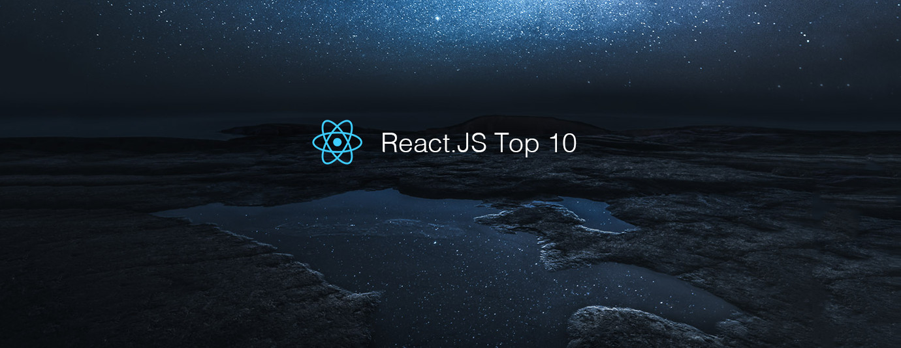

# React.js Top 10 Articles for the Past Month (v.June 2018)

</a>

For the past month, we ranked nearly 1,100 React.js articles to pick the Top 10 stories that can help advance your career (0.9% chance).
 
* Topics in this list: Patterns, Tutorial, GraphQL, Medium.com clone, Context, Learning React, Recat Native, Instagram clone, React 16.3
* Also published on the [publication](https://goo.gl/nKmNm6)

 

#### Course of the month:

[A) Beginners: React 16 — The Complete Guide (incl. React Router 4 & Redux)](http://bit.ly/2CKGqkt) [5,106 recommends, 4.8/5 stars]

[B) Advanced: Advanced React and Redux: 2018 Edition](http://bit.ly/2rffoiX) [5,927 recommends, 4.6/5 stars]

 

## Rank 1
### [Optimizing React: Virtual DOM explained —](https://evilmartians.com/chronicles/optimizing-react-virtual-dom-explained?utm_source=mybridge&utm_medium=blog&utm_campaign=read_more)

 

## Rank 2
### [Andrew Clark: React Suspense](https://www.youtube.com/watch?v=z-6JC0_cOns?utm_source=mybridge&utm_medium=blog&utm_campaign=read_more)

 

## Rank 3
### [Structuring projects and naming components in React](https://hackernoon.com/structuring-projects-and-naming-components-in-react-1261b6e18d76?utm_source=mybridge&utm_medium=blog&utm_campaign=read_more)

 

## Rank 4
### [The most important lessons I’ve learned after a year of working with React](https://medium.freecodecamp.org/mindset-lessons-from-a-year-with-react-1de862421981?utm_source=mybridge&utm_medium=blog&utm_campaign=read_more)

 

## Rank 5
### [A Rock Solid, Modern Web Stack—Rails 5 API + ActiveAdmin + Create React App on Heroku](https://blog.heroku.com/a-rock-solid-modern-web-stack?utm_source=mybridge&utm_medium=blog&utm_campaign=read_more)

 

## Rank 6
### [A complete React with Apollo and GraphQL Tutorial - RWieruch](https://www.robinwieruch.de/react-graphql-apollo-tutorial?utm_source=mybridge&utm_medium=blog&utm_campaign=read_more)

 

## Rank 7
### [How to build your own React boilerplate](https://medium.com/@sethalexander/how-to-build-your-own-react-boilerplate-1a97d09337fd?utm_source=mybridge&utm_medium=blog&utm_campaign=read_more)

 

## Rank 8
### [Building a Chat App with Express, React and Socket.io with GIFs Support](https://quantizd.com/build-chat-app-with-express-react-socket-io?utm_source=mybridge&utm_medium=blog&utm_campaign=read_more)

 

## Rank 9
### [A Gentle Introduction to Prepack, Part 1 - Dan Abramov](https://gist.github.com/gaearon/d85dccba72b809f56a9553972e5c33c4?utm_source=mybridge&utm_medium=blog&utm_campaign=read_more)

 

## Rank 10
### [Supporting React Native at Pinterest](https://medium.com/@Pinterest_Engineering/supporting-react-native-at-pinterest-f8c2233f90e6?utm_source=mybridge&utm_medium=blog&utm_campaign=read_more)

 

## Rank 1
### [Optimizing React: Virtual DOM explained —](https://evilmartians.com/chronicles/optimizing-react-virtual-dom-explained?utm_source=mybridge&utm_medium=blog&utm_campaign=read_more)

 

## Rank 2
### [Andrew Clark: React Suspense](https://www.youtube.com/watch?v=z-6JC0_cOns?utm_source=mybridge&utm_medium=blog&utm_campaign=read_more)

 

## Rank 3
### [Structuring projects and naming components in React](https://hackernoon.com/structuring-projects-and-naming-components-in-react-1261b6e18d76?utm_source=mybridge&utm_medium=blog&utm_campaign=read_more)

 

## Rank 4
### [The most important lessons I’ve learned after a year of working with React](https://medium.freecodecamp.org/mindset-lessons-from-a-year-with-react-1de862421981?utm_source=mybridge&utm_medium=blog&utm_campaign=read_more)

 

## Rank 5
### [A Rock Solid, Modern Web Stack—Rails 5 API + ActiveAdmin + Create React App on Heroku](https://blog.heroku.com/a-rock-solid-modern-web-stack?utm_source=mybridge&utm_medium=blog&utm_campaign=read_more)

 

## Rank 6
### [A complete React with Apollo and GraphQL Tutorial - RWieruch](https://www.robinwieruch.de/react-graphql-apollo-tutorial?utm_source=mybridge&utm_medium=blog&utm_campaign=read_more)

 

## Rank 7
### [How to build your own React boilerplate](https://medium.com/@sethalexander/how-to-build-your-own-react-boilerplate-1a97d09337fd?utm_source=mybridge&utm_medium=blog&utm_campaign=read_more)

 

## Rank 8
### [Building a Chat App with Express, React and Socket.io with GIFs Support](https://quantizd.com/build-chat-app-with-express-react-socket-io?utm_source=mybridge&utm_medium=blog&utm_campaign=read_more)

 

## Rank 9
### [A Gentle Introduction to Prepack, Part 1 - Dan Abramov](https://gist.github.com/gaearon/d85dccba72b809f56a9553972e5c33c4?utm_source=mybridge&utm_medium=blog&utm_campaign=read_more)

 

## Rank 10
### [Supporting React Native at Pinterest](https://medium.com/@Pinterest_Engineering/supporting-react-native-at-pinterest-f8c2233f90e6?utm_source=mybridge&utm_medium=blog&utm_campaign=read_more)

