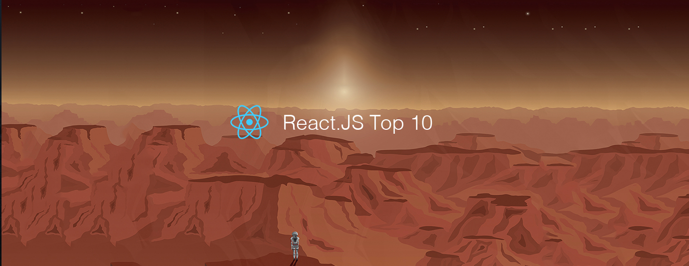

# React.js Top 10 Articles for the Past Month (v.July 2018)

</a>

For the past month, we ranked nearly 1,100 React.js articles to pick the Top 10 stories that can help advance your career (0.9% chance).
 
* Topics in this list: React Native, Webpack 4, Babel, Practices, Redux, Cheatsheet, Movie Search App, Modal component
* Also published on the [publication](https://goo.gl/QEnQBs)

 

#### Course of the month:

[A) Beginners: React Native — The Practical Guide.](http://bit.ly/2EXg3Zu) [1,811 recommends, 4.6/5 stars]

[B) Advanced: Build an app with React, Redux and Firestore from scratch.](http://bit.ly/2N51QNL) [136 recommends, 4.7/5 stars]

 

## Rank 1
### [React Native at Airbnb: Sharing our experience with using React.js [Part 1-5]](https://medium.com/airbnb-engineering/react-native-at-airbnb-f95aa460be1c?utm_source=mybridge&utm_medium=blog&utm_campaign=read_more)

 

## Rank 2
### [State of React Native 2018 · React Native](https://facebook.github.io/react-native/blog/2018/06/14/state-of-react-native-2018?utm_source=mybridge&utm_medium=blog&utm_campaign=read_more)

 

## Rank 3
### [How to build a React project from scratch using Webpack 4 and Babel](https://hackernoon.com/how-to-build-a-react-project-from-scratch-using-webpack-4-and-babel-56d4a26afd32?utm_source=mybridge&utm_medium=blog&utm_campaign=read_more)

 

## Rank 4
### [5 common practices that you can stop doing in React](https://blog.logrocket.com/5-common-practices-that-you-can-stop-doing-in-react-9e866df5d269?utm_source=mybridge&utm_medium=blog&utm_campaign=read_more)

 

## Rank 5
### [Understanding Redux: The World’s Easiest Guide to Beginning Redux](https://medium.freecodecamp.org/understanding-redux-the-worlds-easiest-guide-to-beginning-redux-c695f45546f6?utm_source=mybridge&utm_medium=blog&utm_campaign=read_more)

 

## Rank 6
### [React-typescript-cheatsheet: a cheatsheet for react users using typescript with react for the first (or nth!) time [★958]](https://github.com/sw-yx/react-typescript-cheatsheet?utm_source=mybridge&utm_medium=blog&utm_campaign=read_more)

 

## Rank 7
### [A Swift Developer’s React Native Experience](https://swiftwithjustin.co/2018/06/24/a-swift-developers-react-native-experience?utm_source=mybridge&utm_medium=blog&utm_campaign=read_more)

 

## Rank 8
### [How To Build A Movie Search App With React and ElasticSearch](https://medium.appbase.io/how-to-build-a-movie-search-app-with-react-and-elasticsearch-2470f202291c?utm_source=mybridge&utm_medium=blog&utm_campaign=read_more)

 

## Rank 9
### [Building an accessible Modal component with React Portals: Part 2](https://assortment.io/posts/accessible-modal-component-react-portals-part-2?utm_source=mybridge&utm_medium=blog&utm_campaign=read_more)

 

## Rank 10
### [You Probably Don't Need Derived State](https://reactjs.org/blog/2018/06/07/you-probably-dont-need-derived-state.html?utm_source=mybridge&utm_medium=blog&utm_campaign=read_more)

 

