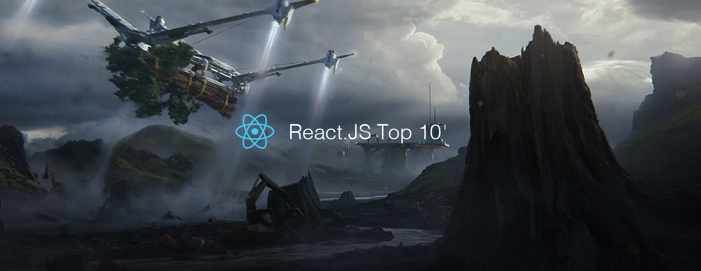

# React.js Top 10 Articles for the Past Month (v.Nov 2018)

</a>

For the past month, we ranked nearly 1,100 React.js articles to pick the Top 10 stories that can help advance your career (0.9% chance).
 
* Topics in this list: React Hooks, Fullstack Guide, Job Interview, Fundamentals, Manage State, SOLID, React 16.6, GraphQL, Webpack 4
* Also published on the [publication](https://goo.gl/C8vn3r)

 

#### Course of the month:

[A) Beginners: Node with React: Fullstack Web Development.](http://bit.ly/2EQfnEN) [6,831 recommends, 4.6/5 stars]

[B) Advanced React and Redux: 2018 Edition.](http://bit.ly/2rffoiX) [7,012 recommends, 4.7/5 stars]

 

## Rank 1
### [Introducing Hooks – React](https://reactjs.org/docs/hooks-intro.html?utm_source=mybridge&utm_medium=blog&utm_campaign=read_more)

 

## Rank 2
### [Making Sense of React Hooks](https://medium.com/@dan_abramov/making-sense-of-react-hooks-fdbde8803889?utm_source=mybridge&utm_medium=blog&utm_campaign=read_more)

 

## Rank 3
### [Fullstack React: The Fullstack Guide To What's New in Create React App 2.0](https://www.fullstackreact.com/articles/fullstack-guide-whats-new-in-create-react-app-and-how-to-use-it?utm_source=mybridge&utm_medium=blog&utm_campaign=read_more)

 

## Rank 4
### [A React job interview — recruiter perspective.](https://medium.com/@baphemot/a-react-job-interview-recruiter-perspective-f1096f54dd16?utm_source=mybridge&utm_medium=blog&utm_campaign=read_more)

 

## Rank 5
### [These React Fundamentals You Skip may be Killing You](https://medium.freecodecamp.org/these-react-fundamentals-you-skip-may-be-killing-you-7629fb87dd4a?utm_source=mybridge&utm_medium=blog&utm_campaign=read_more)

 

## Rank 6
### [A different way to manage state in React](https://hackernoon.com/a-different-way-to-manage-state-in-react-2d21dfb94482?utm_source=mybridge&utm_medium=blog&utm_campaign=read_more)

 

## Rank 7
### [How to apply SOLID principles in React applications](https://blog.usejournal.com/how-to-apply-solid-principles-in-react-applications-6c964091a982?utm_source=mybridge&utm_medium=blog&utm_campaign=read_more)

 

## Rank 8
### [React 16.6 - What's New? Theory + Practice](https://www.youtube.com/watch?v=BnasObkCGtQ?utm_source=mybridge&utm_medium=blog&utm_campaign=read_more)

 

## Rank 9
### [GraphQL: A success story for PayPal Checkout](https://medium.com/paypal-engineering/graphql-a-success-story-for-paypal-checkout-3482f724fb53?utm_source=mybridge&utm_medium=blog&utm_campaign=read_more)

 

## Rank 10
### [React + Webpack 4 + Babel 7 Setup Tutorial](https://www.robinwieruch.de/minimal-react-webpack-babel-setup?utm_source=mybridge&utm_medium=blog&utm_campaign=read_more)

                    
