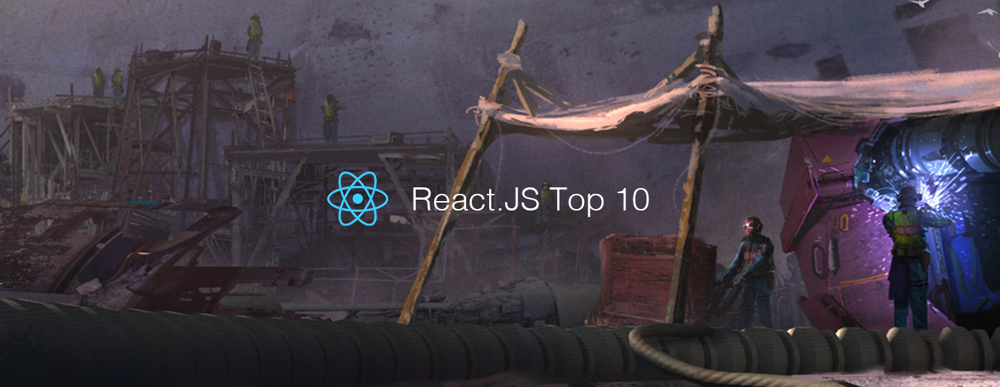

# React.js Top 10 Articles for the Past Month (v.Dec 2018)

</a>

For the past month, we ranked nearly 1,100 React.js articles to pick the Top 10 stories that can help advance your career (0.9% chance).
 
* Also published on the [publication](https://goo.gl/qRGjtt)

 

#### Course of the month:

[A) Beginners: React 16 — The Complete Guide (incl. React Router 4 & Redux).](http://bit.ly/2CKGqkt) [20,302 recommends, 4.7/5 stars]

[B) Create Chatbot for Website with React and Node.js.](http://bit.ly/2PqI8Mr) [510 recommends, 4.5/5 stars]

 

## Rank 1
### [A Netflix Web Performance Case Study](https://medium.com/dev-channel/a-netflix-web-performance-case-study-c0bcde26a9d9?utm_source=mybridge&utm_medium=blog&utm_campaign=read_more)

 

## Rank 2
### [An Introduction to Hooks in React](https://www.fullstackreact.com/articles/an-introduction-to-hooks-in-react?utm_source=mybridge&utm_medium=blog&utm_campaign=read_more)

 

## Rank 3
### [How to fetch data with React Hooks?](https://www.robinwieruch.de/react-hooks-fetch-data?utm_source=mybridge&utm_medium=blog&utm_campaign=read_more)

 

## Rank 4
### [These are the concepts you should know in React.js (after you learn the basics)](https://medium.freecodecamp.org/these-are-the-concepts-you-should-know-in-react-js-after-you-learn-the-basics-ee1d2f4b8030?utm_source=mybridge&utm_medium=blog&utm_campaign=read_more)

 

## Rank 5
### [How Does React Tell a Class from a Function?](https://overreacted.io/how-does-react-tell-a-class-from-a-function?utm_source=mybridge&utm_medium=blog&utm_campaign=read_more)

 

## Rank 6
### [Fast as never before. Code-splitting with React Suspense, lazy + Router + Redux + Webpack 4](https://medium.com/@svyat770/fast-as-never-before-code-splitting-with-react-suspense-lazy-router-redux-webpack-4-d55a95970d11?utm_source=mybridge&utm_medium=blog&utm_campaign=read_more)

 

## Rank 7
### [Inside Fiber: in-depth overview of the new reconciliation algorithm in React](https://medium.com/react-in-depth/inside-fiber-in-depth-overview-of-the-new-reconciliation-algorithm-in-react-e1c04700ef6e?utm_source=mybridge&utm_medium=blog&utm_campaign=read_more)

 

## Rank 8
### [Build a React To-Do App with React Hooks (No Class Components)](https://scotch.io/tutorials/build-a-react-to-do-app-with-react-hooks-no-class-components?utm_source=mybridge&utm_medium=blog&utm_campaign=read_more)

 

## Rank 9
### [State of React State Management in 2019](https://blog.bitsrc.io/state-of-react-state-management-in-2019-779647206bbc?utm_source=mybridge&utm_medium=blog&utm_campaign=read_more)

 

## Rank 10
### [The how and why on React’s usage of linked list in Fiber to walk the component’s tree: The main algorithm of the work loop in React’s reconciler](https://medium.com/dailyjs/the-how-and-why-on-reacts-usage-of-linked-list-in-fiber-67f1014d0eb7?utm_source=mybridge&utm_medium=blog&utm_campaign=read_more)

                    
